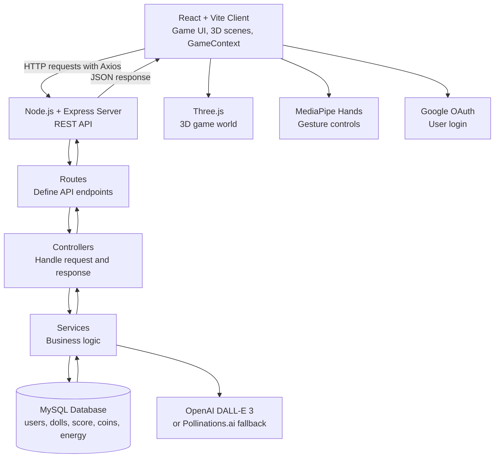
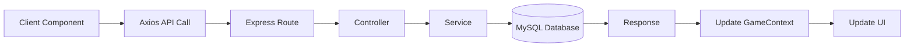
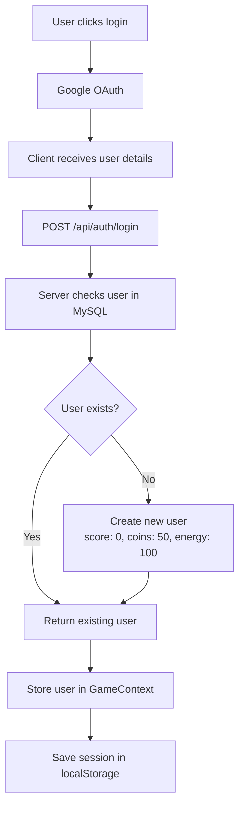
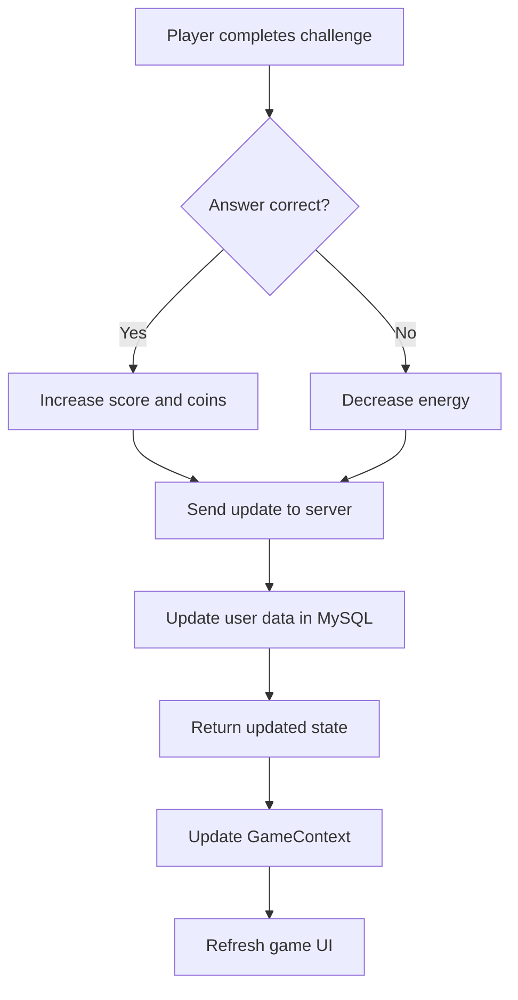
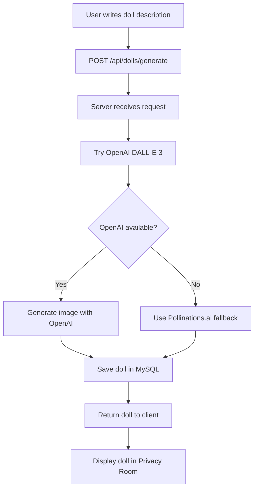

# BeSafe Hackathon 2026 🏆 2nd Place Winner
## QueenB X AppsFlyer - BeSafe Hackathon 2026
### SafeForest - Cybersecurity Education Game
A 3D cybersecurity education game for children and teenagers.

SafeForest helps young users learn about online safety through interactive gameplay instead of a static learning platform. Players explore a virtual world, complete cybersecurity challenges, earn coins and badges, lose energy for unsafe choices, and learn about topics such as password strength, privacy, and safe digital behavior.

Built as part of the QueenB x AppsFlyer BeSafe Hackathon 2026, where the project reached the finals and won 2nd place.

## Demo

Add demo video, screenshots, or presentation link here.

## How it works

SafeForest is built as a web-based 3D game.

The user logs in with Google OAuth and enters a virtual world with different educational rooms. Each room focuses on a different online safety topic, such as password security, privacy protection, or safe decision-making.

During the game, the user can earn score points, collect coins, unlock badges, buy robot companions, and lose energy after wrong choices. The user state is managed on the client and persisted in a MySQL database through a backend REST API.

The game also supports hand gesture controls using MediaPipe Hands, allowing the player to control the robot using real-time hand movements.

In the Privacy Room, users can generate AI-based visualizations that demonstrate the risks of sharing personal information.

## Architecture

The project follows a client-server-database architecture.

The client is responsible for the game experience, 3D scenes, user interaction, scene navigation, and global state management.

The server exposes a REST API and handles authentication, game logic, shop actions, doll generation, and database communication.

The database stores persistent user data such as score, coins, energy, selected robots, and generated dolls.



## Main data flow



## Main flows

### Login flow



### Game progress flow



### AI doll generation flow



## Stack

### Frontend

- React + Vite
- Three.js / React Three Fiber
- MediaPipe Hands
- React Router
- Axios
- React Context API

### Backend

- Node.js
- Express.js
- REST API
- Google OAuth integration
- OpenAI SDK
- Pollinations.ai fallback

### Database

- MySQL
- mysql2/promise connection pool

### Tools

- Git
- GitHub
- npm
- dotenv

## Project structure

```text
client/
  src/
    game/              # Main game components and scenes
    context/           # GameContext global state
    api/               # Axios API modules
    components/        # Reusable UI components
    pages/             # Login and main pages
    hooks/             # Custom hooks

server/
  routes/              # API endpoints
  controllers/         # Request and response handling
  services/            # Business logic
  models/              # Data models
  middlewares/         # Auth and error handling
  utils/               # Helper functions
  server.js            # Express entry point

db/
  db.js                # MySQL connection pool
  init_db.sql          # Database schema
```

## API overview

### Authentication

| Method | Endpoint | Description |
|---|---|---|
| POST | `/api/auth/login` | Google OAuth login and user creation |

### Users

| Method | Endpoint | Description |
|---|---|---|
| GET | `/api/users/:userId` | Get user data |
| POST | `/api/user/update-points-coins` | Update score, coins, and energy |

### Dolls

| Method | Endpoint | Description |
|---|---|---|
| POST | `/api/dolls/generate` | Generate AI doll |
| GET | `/api/dolls/:userId` | Get user's dolls |
| DELETE | `/api/dolls/:id` | Delete doll |

### Shop

| Method | Endpoint | Description |
|---|---|---|
| POST | `/api/shop/buy-robot` | Buy robot companion |
| POST | `/api/shop/select-robot` | Select active robot |
| GET | `/api/shop/robots/:userId` | Get user's robot collection |

## Quick start

### Prerequisites

- Node.js 20+
- npm 10+
- MySQL

### Database setup

```bash
mysql -u your_username -p < db/init_db.sql
```

### Server setup

```bash
cd server
npm install
cp .env.example .env
npm run dev
```

The server runs on:

```text
http://localhost:5000
```

### Client setup

```bash
cd client
npm install
cp .env.example .env
npm run dev
```

The client runs on:

```text
http://localhost:5173
```

## Environment variables

### Server `.env`

```env
PORT=5000
CLIENT_URL=http://localhost:5173

DB_HOST=localhost
DB_USER=your_mysql_username
DB_PASSWORD=your_mysql_password
DB_NAME=ai_factory

OPENAI_API_KEY=optional_openai_key
GEMINI_API_KEY=optional_gemini_key
```

### Client `.env`

```env
VITE_SERVER_API_URL=http://localhost:5000
VITE_GOOGLE_CLIENT_ID=your_google_oauth_client_id
```

## Design decisions

### Why React Context?

React Context was used to manage global game state such as the logged-in user, score, coins, energy, badges, inventory, selected robot, and current scene.

It was simple and effective for an MVP. In a larger production version, the context could be split into smaller contexts or replaced with a more structured state management solution.

### Why Three.js?

Three.js allowed us to create an immersive 3D learning experience, which made the educational content more engaging for children.

The tradeoff is that 3D rendering can affect performance, especially on weaker devices.

### Why MediaPipe Hands?

MediaPipe Hands gave the game a unique interaction model using real-time hand gestures.

The tradeoff is dependency on camera permissions, browser support, and device performance, so keyboard controls are also supported.

### Why Node.js and Express?

Node.js and Express allowed us to build a REST API quickly and keep the backend simple and flexible for an MVP.

The tradeoff is that Express does not enforce a strict structure, so we used a layered architecture to keep the code organized.

### Why MySQL?

MySQL was used because the project stores structured data such as users, score, coins, energy, selected robots, and generated dolls.

It fits the project well because these entities have clear relationships and need persistent storage.

### Why layered backend architecture?

The backend is separated into routes, controllers, services, models, and middlewares.

This keeps API definitions, request handling, business logic, and database access separated, making the code easier to understand, debug, and extend.

## Notes

- OpenAI API key is optional. If unavailable, the app uses Pollinations.ai as a fallback.
- Client runs on port `5173`.
- Server runs on port `5000`.
- MySQL database name is `ai_factory`.
- User session is stored in localStorage and synced with MySQL.
- The project was built as an MVP for a hackathon, not as a fully production-ready system.

## Future improvements

- Add unit and integration tests
- Improve request validation and error handling
- Add Docker support for easier setup
- Add CI/CD pipeline
- Improve 3D performance on weaker devices
- Add structured logging and monitoring
- Improve scalability with multiple backend instances and load balancing
- Add stronger production-level authentication and authorization checks
